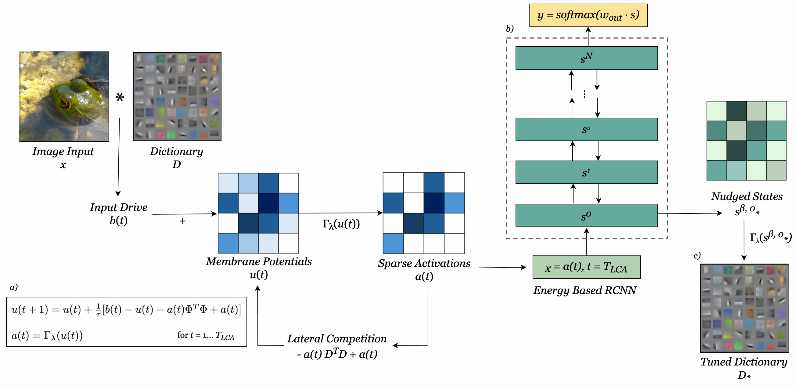

This repository contains code to train an energy-based model with a sparse coding frontend with equilibrium propagation and fine tune the sparse layer's dictionary for classification.

- main_fast.py: parses shell scripts, constructs model, optimizers, runs model from appropriate utils.py
- cifar_dictlearning.py: script to train a sparse coding dictionary with the Locally Competitive Algorithm 
- utils_ep_fast.py: functions to build and train an energy-based recurrent convolutional neural network (RCNN) with image input
- lca_utils_ep.fast: functions to build and train an energy-based RCNN with a front sparse coding layer. Options to use a *pretrained* sparse dictionary, which is held fixed during EBM training with equilibrium propagation and preprocesses inputs with LCA dynamics or learn the sparse dictionary during RCNN training.
- data_utils.py: plotting and logging functions
- eval_lcanet.ipynb: evaluating and plotting trained model results 
- run/: shell scripts for running models and experiments

Figure: Our framework for training an energy-based model and fine tuning a sparse coding dictionary for image classification. a) Image inputs, $x$, drive the dynamics of the locally competitive algorithm over $T_{LCA}$ timesteps, settling to a sparse set of activations that minimize reconstruction error when combined with a pre-trained dictionary, $D$. b) Sparse activations $a(t), t = T_{LCA}$ are passed to an energy-based recurrent model, which we train for classification with EqProp. Input activations are held static while a copy of the sparse activations is allowed to evolve with the energy based system. In the second phase of EqProp, the output of the network is nudged based on classification loss and settles to a new configuration, ${s_\*}^{\beta}$. c) During EBM training with EqProp, the nudged, settled state of the sparse activation-like layer, ${s_\*}^{\beta, 0}$, is used to fine-tune the sparse coding dictionary $D_\*$.

## Training using EqProp with symmetric connections
#### RCNN
    python main_fast.py --model 'CNN' --task 'CIFAR10' --data-aug --channels 64 128 256 512 --kernels 3 3 3 3 --pools 'mmmm' --strides 1 1 1 1 --paddings 1 1 1 1 --fc 10 --optim 'sgd' --lrs 0.25 0.15 0.1 0.08 0.05 --wds 3e-4 3e-4 3e-4 3e-4 3e-4  --mmt 0.9 --lr-decay --epochs 35 --act 'my_hard_sig' --todo 'train' --T1 250 --T2 50 --mbs 128 --alg 'EP' --betas 0.0 1.0 --thirdphase --loss 'cel' --softmax --save

#### RCNN with a (pretrained) LCA preprocessing layer
    python main_fast.py --model LCACNN --task CIFAR10 --data-aug --channels 64 256 512 --kernels 3 3 3 --pools immmm --strides 1 1 1 1 --paddings 1 1 1 1 --fc 10 --optim sgd --lrs 0.25 0.15 0.1 0.08 --wds 3e-4 3e-4 3e-4 3e-4 3e-4 --mmt 0.9 --lr-decay --epochs 120 --act my_hard_sig --todo train --T1 250 --T2 50 --mbs 128 --alg EP --betas 0.0 0.5 --scale 0.5 --thirdphase --loss cel --softmax --save --seed 2 --lca_feats 64 --lca_lambda 0.25 --lca_tau 100 --lca_eta 0.05 --lca_iters 600 --lca_stride 2 --lca_ksize 9 --dict_training pretrained

#### RCNN and tuning the dictionary of an LCA preprocessing layer
    python main_fast.py --model LCACNN --task CIFAR10 --data-aug --channels 64 256 512 --kernels 3 3 3 --pools immmm --strides 1 1 1 1 --paddings 1 1 1 1 --fc 10 --optim sgd --lrs 0.25 0.15 0.1 0.08 --wds 3e-4 3e-4 3e-4 3e-4 3e-4 --mmt 0.9 --lr-decay --epochs 120 --act my_hard_sig --todo train --T1 250 --T2 50 --mbs 128 --alg EP --betas 0.0 0.5  --scale 0.5 --thirdphase --loss cel --softmax --save --seed 2 --lca_feats 64 --lca_lambda 0.25 --lca_tau 100 --lca_eta 0.05 --lca_iters 600 --lca_stride 2 --lca_ksize 9 --dict_training finetune 

#### RCNN and learning the dictionary of an LCA preprocessing layer
    python main_fast.py --model LCACNN --task CIFAR10 --data-aug --channels 64 256 512 --kernels 3 3 3 --pools immmm --strides 1 1 1 1 --paddings 1 1 1 1 --fc 10 --optim sgd --lrs 0.25 0.15 0.1 0.08 --wds 3e-4 3e-4 3e-4 3e-4 3e-4 --mmt 0.9 --lr-decay --epochs 120 --act my_hard_sig --todo train --T1 250 --T2 50 --mbs 128 --alg EP --betas 0.0 0.5 --scale 0.5 --thirdphase --loss cel --softmax --save --seed 2 --lca_feats 64 --lca_lambda 0.25 --lca_tau 100 --lca_eta 0.05 --lca_iters 600 --lca_stride 2 --lca_ksize 9 --dict_training learn

## Summary table of command line arguments  

|Arguments|Description|Examples|
|-------|------|------|
|`model`|Choose MLP or CNN and Vector field.|`--model 'CNN'`, `--model 'LCACNN'`|
|`task`|Choose the task.|`--task 'MNIST'`, `--task 'CIFAR10'`|
|`data-aug`|Enable data augmentation for CIFAR10.|`--data-aug`|
|`lr-decay`|Enable learning rate decay.|`--lr-decay`|
|`scale`|Multiplication factor for weight initialization.|`--scale 0.2`|
|`channels`|Feature maps for CNN.|`--channels 128 256 512`|
|`pools`|Layers wise poolings. `m` is maxpool, `a` is avgpool and `i` is no pooling. All are kernel size 2 and stride 2.|`--pools 'mmm'` for 3 conv layers.|
|`kernels`|Kernel sizes for CNN.|`--kernels 3 3 3`|
|`strides`|Strides for CNN.|`--strides 1 1 1`|
|`paddings`|Padding for conv layers.|`--paddings 1 1 1`|
|`fc`|Linear classifier|`--fc 10` for one fc layer, `--fc 512 10`|
|`act`|Activation function for neurons|`--act 'tanh'`,`'mysig'`,`'hard_sigmoid'`|
|`todo`|Train or evaluate model|`--todo 'train'`,`--todo 'evaluate'`|
|`alg`|EqProp.|`--alg 'EP'`|
|`T1`,`T2`|Number of time steps for phase 1 and 2.|`--T1 30 --T2 10`|
|`betas`|Beta values beta1 and beta2 for EP phases 1 and 2.|`--betas 0.0 0.1`|
|`random-sign`|Choose a random sign for beta2.|`--random-sign`|
|`thirdphase`|Two phases 2 are done with beta2 and -beta2.|`--thirdphase`|
|`loss`|Loss functions.|`--loss 'mse'`,`--loss 'cel'`, `--loss 'cel' --softmax`|
|`optim`|Optimizer for training.|`--optim 'sgd'`, `--optim 'adam'`|
|`lrs`|Layer wise learning rates.|`--lrs 0.01 0.005`|
|`wds`|Layer wise weight decays. (`None` by default).|`--wds 1e-4 1e-4`|
|`mmt`|Global momentum. (if SGD).|`--mmt 0.9`|
|`lca_feats`|Number of LCA dictionary features.|`--lca_feats 64`|
|`lca_lambda`|LCA lambda.|`--lca_lambda 0.25`|
|`lca_tau`|LCA tau.|`--lca_tau 100`|
|`lca_eta`|LCA eta.|`--lca_eta 0.001`|
|`lca_stride`|LCA stride.|`--lca_stride 1`|
|`lca_iters`|LCA iterations.|`--lca_iters 1`|
|`scale_feedback`|Factor to scale feedback from convolutional layers to LCA activations for fine tuning.|`--scale_feedback 0.01`|
|`dict_training`|Static pretrained, fine-tune, or learn sparse coding dictionary during RCNN training. |` --dict_training finetune'`|
|`epochs`|Number of epochs.|`--epochs 200`|
|`mbs`|Minibatch size|`--mbs 128`|
|`device`|Index of the gpu.|`--device 0`|
|`save`|Create a folder to save the model, plot metrics, neural activations, and LCA weights.|`--save`|
|`seed`|Choose the seed.|`--seed 0`|

### LCA Sparse Coding PyTorch Implementation
This repository leverages functions from lca-pytorch (https://github.com/lanl/lca-pytorch).

### EqProp Implementation similar to "Scaling Equilibrium Propagation to Deep ConvNets by Drastically Reducing its Gradient Estimator Bias"

This repository contains some code reworked from https://github.com/Laborieux-Axel/Equilibrium-Propagation, which produced the results of [the paper](https://arxiv.org/abs/2006.03824) "Scaling Equilibrium Prop to Deep ConvNets by Drastically Reducing its Gradient Estimator Bias". 
